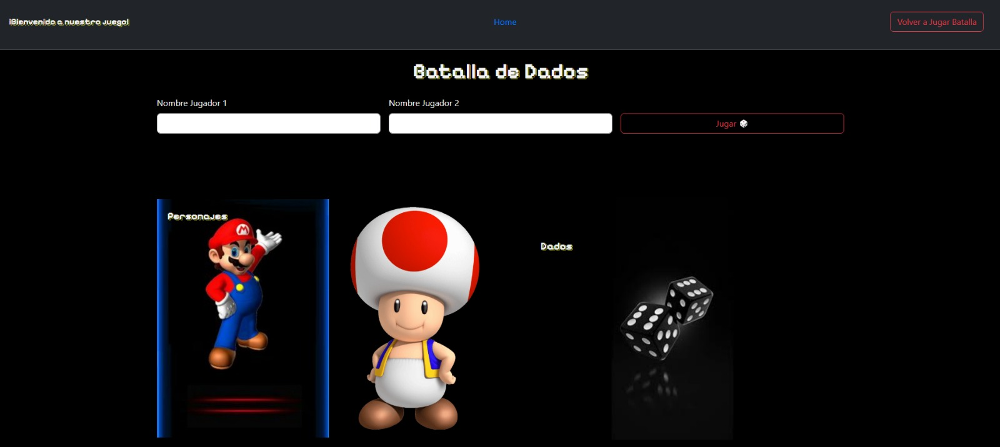
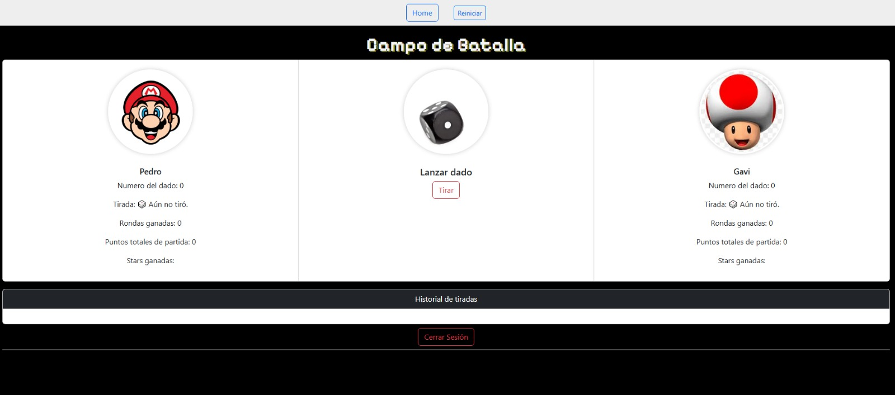
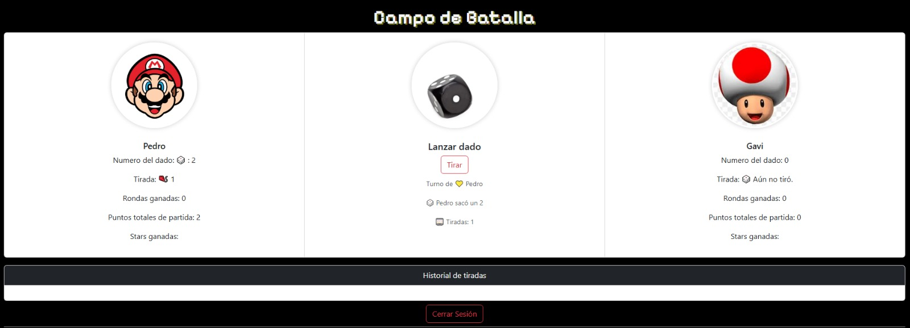
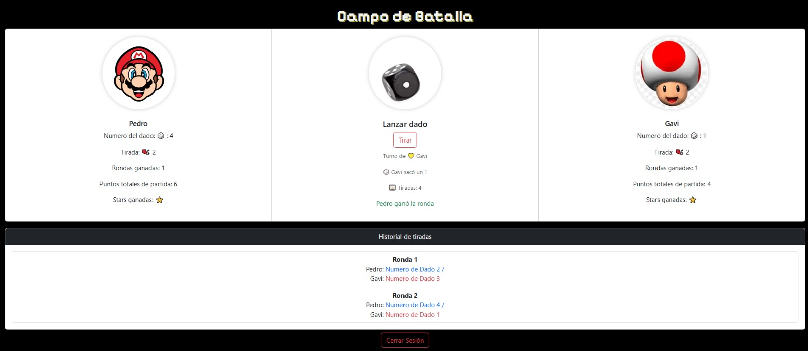
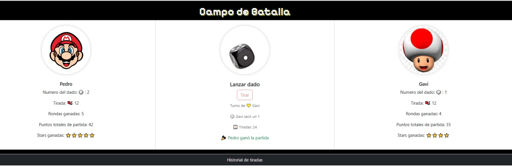

Proyecto del juego de dados con rondas, historial, localStorage, login de jugadores y toda la lógica basica.

---

# 🎲 **Batalla de Dados – README**

Batalla de Dados es un mini-juego web donde dos jugadores compiten por ganar rondas tirando un dado por turnos.
El objetivo es ganar **5 rondas**. Cada ronda se decide por la tirada más alta.

El juego guarda automáticamente el progreso usando **localStorage**, permitiendo salir y volver más tarde.
Incluye turnos, rondas, historial, reinicio de partida y cierre de sesión.

---

## 🚀 **Características**

### ✔ Inicio de sesión

En `index.html`, los jugadores ingresan sus nombres.
Los nombres se guardan en `localStorage` para permitir volver a la partida.

### ✔ Lógica del juego

* Turnos alternados entre Jugador 1 y Jugador 2.
* Cada tirada genera un número del 1 al 6.
* Cada jugador acumula:

  * Última tirada
  * Número de tirada
  * Puntos totales
  * Rondas ganadas

### ✔ Rondas

* Cada 2 tiradas (J1 y J2), se evalúa la ronda:

  * Mayor número → gana la ronda
  * Empate → la ronda queda sin ganador
* El primero en ganar **5 rondas** gana la partida.

### ✔ Historial

Cada ronda jugada se agrega al historial mostrando:

* Número de ronda
* Tirada de J1
* Tirada de J2
* Ganador de la ronda

### ✔ Guardado automático con localStorage

El juego guarda:

* Nombres de jugadores
* Estado de la partida
* Turno actual
* Rondas ganadas
* Historial

Si el usuario recarga o vuelve a la página, se recupera la partida automáticamente.

### ✔ Cerrar sesión

* Borra todo del localStorage
* Deshabilita el enlace para "Volver a la partida"
* Vacía completamente la partida
* Vuelve al index sin permitir jugar hasta ingresar nombres nuevamente

### ✔ Reinicio de partida

Botón desde la página de batalla para reiniciar:

* Rondas
* Tiradas
* Puntos
* Historial
* Turnos

---

# 📂 **Estructura del Proyecto**

```
/assets
   /imgsDados
      dado1.png
      dado2.png
      ...
/classes
   dado.js
   jugador.js
   partida.js
app.js
batalla.html
index.html
README.md
styles.css
```

---

# 🧩 **Clases del Proyecto**

### **class Jugador**

Representa a cada jugador.

* nombre
* puntos (última tirada)
* ultimaTirada
* rondasGanadas
* totalPuntos
* tiradas[]

### **class Dado**

* lanzar() → devuelve número aleatorio del 1 al 6
*  obtenerImagen(resultado) → Retorna la imagen que corresponde a la cara del dado según el resultado

### **class Partida**

Maneja toda la lógica del juego:

* turno
* ronda actual
* historial
* objetivo (5 rondas)
* terminar partida
* resolver ronda
* guardar estado
* cambiar turno
* tirar dado
* verificar ganador

---

# 🖥 **Flujo del Juego**

1. El usuario entra al `index.html`.
2. Ingresa los nombres.
3. Se habilita el botón “Jugar”.
4. Se redirige a la página `batalla.html`:

   * Carga estado si existe
   * O crea partida nueva
5. El jugador con turno presiona “Tirar Dado”.
6. Se muestra:

   * Número del dado
   * Tirada actual (tirada 1, tirada 2, …)
7. Cada dos tiradas se evalúa la ronda.
8. Se muestra quién la ganó.
9. Cuando alguien llega a 5 rondas:

   * Se muestra ganador final
   * Se usa la libreria Confetti.js para animar el fin de la partida ganada
   * Se bloquea el botón de tirar

---

# 🧹 **Cierre de Sesión**

El botón "Cerrar sesión":

* Borra:

  * `nombreJ1`
  * `nombreJ2`
  * `batalla-dados-estado`
* Deshabilita el enlace para volver a la partida
* Redirige al index
* Obliga a cargar nombres nuevamente

---

## 📸 Capturas del juego

### 🏁 Pantalla de Inicio


---

### ⚔️ Pantalla de Batalla


---

### 🎰 Inicio de Partida


---

### 🎰 Lanza segundo Jugador


---


### 🎲 Partida Finalizada


---

# 🛠 **Tecnologías Usadas**

* JavaScript ES6 (clases, módulos)
* HTML5 + CSS3
* localStorage
* DOM API

---

# ▶ **Cómo Ejecutar el Proyecto**

1. Descargá o cloná el proyecto.
2. Abrí `index.html`.
3. Ingresá los nombres.
4. Comenzá a jugar.

---

# 📜 **Licencia**

Uso libre para practicar JavaScript.
No requiere créditos, pero si querés mencionarme: **Gabi & Nat project ❤️**

---


